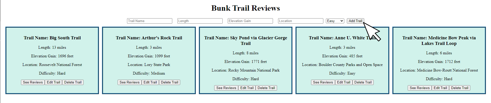

# Bunk Trail Reviews

Bunk Trail Reviews is a web application that can be used to store information about specific outdoor use trails, as well as associated reviews of those trails.

## Installation

- In order to install the application, please `fork` and `clone` this repository to your local device.

- In order to start the application, please make sure you are in the project directory, then run `npm start`.

- If an error is encountered running `npm start`, please run `npm install` to install the required dependencies, then try running `npm start` once more.

- To make sure that the backend of the application works, you must fork and clone the [backend repository](https://github.com/ZachatorCodes/phase-3-project-backend), and then start the server with using the `bundle exec rake server` command. Further instructions for installing and running the backend can be found in the README file of the [backend repository](https://github.com/ZachatorCodes/phase-3-project-backend).

## Usage

- In order to add a new trail to the database, please use the controlled form at the top of the page. Once the trail information has been filled out, please select the "Add Trail" button to add the trail to the database and in turn the page.

- In order to edit an existing trail's information, please select the "Edit Trail" button near the bottom of the trail's information card. This will redirect you to a page containing a pre-filled form using the existing information for the selected trail. Please update the trail information accordingly, then select the "Update Trail" button to update the trail information in the database, and in turn on the page. Once "Update Trail" is selected, you will be redirected back to the homepage containging information for all trails.

- In order to see reviews for a specific trail, please select the "See Reviews" button near the bottom of the trail's information card. This will redirect you to a page displaying all of the reviews for the selected trail. To add a new review to the selected trail, please fill out the provided review form and then select the "Add Review" button. This will add an associated review to the database and in turn reflect it on the page. To return to the home page, please select the "Go Back Home" button near the top of the page.

- In order to delete a trail, please select the "Delete Trail" button near the bottom of the trail's information card. This will remove the trail from the databse, and in turn reflect that on the page.